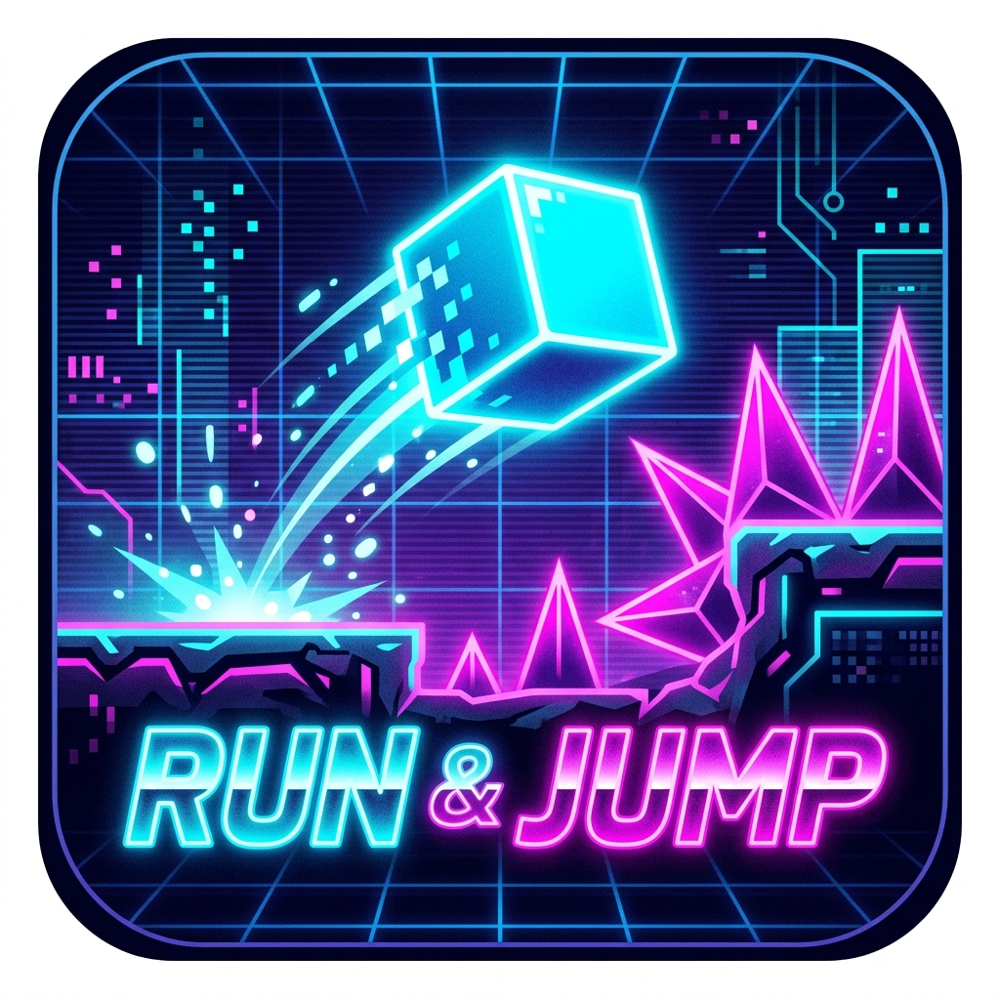

# Run & Jump (RG Rotate Special)

<div align="center">
  
  
  ### 🎮 RG Rotate 特化 ワンボタン・強制スクロール・サイバーパンク ローグライクジャンプアクション
</div>

---

## 🕹️ ゲーム概要 & 操作設計

- **🎮 RG Rotate / ゲームパッド操作:**
  - **ジャンプ / 決定:** `A / B / X / Y ボタン`、`スペースキー`、または画面タップ
  - **メニュー / スキル選択:** `十字キー (D-Pad)` またはマウス/タップ
  - **ポーズ:** `START` / `ESCAPE` / 画面右上 `||` ボタン
  - **キャンセル / 戻る:** `Bボタン` / `Back`
- **🏃‍♂️ コアアクション & 挙動設計:**
  - **初期2段ジャンプ:** 初期状態から2段ジャンプ可能（スキルで多段ジャンプへ拡張）。
  - **可変ジャンプ:** 短押しで小ジャンプ、長押しで大ジャンプ。
  - **快適な入力感:** コヨーテタイム (0.12s) ＆ 先行入力バッファ (0.12s) 搭載。
  - **頭上踏みつけ判定:** 敵の頭上から接触すると一撃粉砕＋上空へ大バウンド。
  - **画面外防止 ＆ 自然な押し戻し制御:** 足場側面に衝突しても画面左端（X=24px）で耐え、通過後に基準位置（X=160px）へスムーズに復帰。
  - **即リトライ:** ゲームオーバー後、0.25秒でワンボタン瞬時リスタート。

---

## 👾 多彩な敵モブ（全6種類）

1. 🚶 **パトロール兵 (`patrol`):** 地上を左右に巡回する基本敵。
2. 🦘 **ホッパー (`hopper`):** 定期的に小ジャンプしながら前進する跳躍敵。
3. 🚁 **飛行ドローン (`drone`):** 空中をサイン波で浮遊・前進。空中ジャンプで踏みつけや自動射撃で撃破！
4. 🛡️ **重装シールドエネミー (`shield_heavy`):** 前面にエネルギーシールドを展開する高HP敵。頭上踏みつけや貫通弾が有効。
5. 🔫 **タレット砲台 (`turret`):** 足場に固定され、前方へ定期的に光弾を発射する砲台。
6. ⚡ **サイバーハウンド (`rusher`):** プレイヤーが近づくと急加速して突進してくる俊敏な敵。

---

## 💎 コイン（Core Shard）収集 ＆ マグネット吸引

- **ステージ配置コイン:** 空中コインアーチ、高所隠しルート、連続ライン配置。
- **敵撃破・踏みつけボーナス:** 敵を倒すとコインが勢いよく飛び散る！
- **マグネット吸引:** プレイヤーの磁力範囲に入ると加速して自動回収。
- **収集音 ＆ 永続セーブ:** 心地よいチャリン音（Synth音声）とともに回収。集めたコインはラン終了時にビルド画面の通貨へ自動セーブ加算。

---

## ⚡ ランのテンポ改革: SPストック & チェックポイント制

1. **走行中はノンストップ（SPストック制）:**
   - 走行中のEXP獲得・レベルアップ時はゲームを止めず、**SP（スキルポイント）** を自動ストック（HUDに `⚡ SP: ○` 表示）。
2. **500m ごとの UPGRADE STATION（チェックポイント）:**
   - 500mごとに安全なチェックポイント足場が出現。
   - 到達時にゲームが安全にポーズし、ストックしたSPを消費して **3択のスキルカード（十字キーで手動選択）** でまとめてパワーアップ！
3. **目印 & 接近予告演出:**
   - **HUD**: 右上に「セクション進行度バー」常時表示 ＋ 残り80m以内で画面上部に「`⚡ UPGRADE STATION AHEAD ! ⚡`」がネオン点滅。
   - **ステージ**: 天空高く伸びる **巨大レーザー光柱（ビーム）**、**ネオンアーチゲート**、**誘導灯** で遠くからでも一目瞭然。

---

## 🛠️ LOADOUT & BUILD（独立シーン化 & 装備システム）

タイトル画面の **[BUILD / LOADOUT]** から専用の独立シーン（`scenes/BuildMenu.tscn`）に遷移。

- **🔫 WEAPONS（武器）:**
  - `Pulse Laser`: 基本の高速レーザー（貫通・バランス型）
  - `Scatter Shot`: 3方向へ広がる拡散ショット（広範囲迎撃）
  - `Plasma Cannon`: 高威力の大口径プラズマ弾
- **💍 RELICS（レリック）:**
  - `Feather Charm`: 重力軽減（ジャンプ滞空時間+15%）
  - `Spike Guard`: トゲ・接触ダメージを20%軽減
  - `Vampire Ring`: 敵5体撃破ごとにHPを自動回復
- **⚡ PERKS（永続パーク強化）:**
  - `MAX HP`: 最大HPアップ (+20/Lv)
  - `FIRE RATE`: 自動攻撃の連射速度アップ (+15%/Lv)
  - `MAGNET RANGE`: EXPジェム・コイン吸引範囲拡大 (+40px/Lv)

---

## 🌆 多彩なマップバリエーション（24パターン）& 超美麗背景

- **🌆 3つのバイオーム（ゾーン）:**
  - **Zone 1: NEO CITY (0m ~ 1000m)**: ネオンシアン、ビル屋上足場。
  - **Zone 2: ACID SLUM (1000m ~ 2000m)**: アシッドグリーン、トゲ密集地帯・高速敵。
  - **Zone 3: DIGITAL VOID (2000m ~ )**: ディープパープル、高低差多層ルート。
- **🚀 24種類の多彩なチャンクパターン:**
  - ジャンプパッド空中回廊、コインアーチ大ジャンプ、ドローン迎撃路、タレット防衛線、上下分岐ルートなど。
- **🌌 超美麗マルチレイヤー・パララックス背景:**
  - ゾーン連動グラデーション空、煌めく星空、巨大サイバー惑星（環・グリッド付き）。
  - 幾重にも重なるメガコーポ超高層ビル群（窓の明かり、赤い航空障害灯）。
  - 空中を行き交うホバーカー（光の軌跡）、サイバーネオン看板、舞い散るサイバーダスト。

---

## 📱 Android 向けビルド & adb インストール

```bash
Godot_v4.7.2-stable_win64_console.exe --headless --export-debug "Android" build/runandjump.apk
adb install -r build/runandjump.apk
adb shell monkey -p com.example.runandjump -c android.intent.category.LAUNCHER 1
```